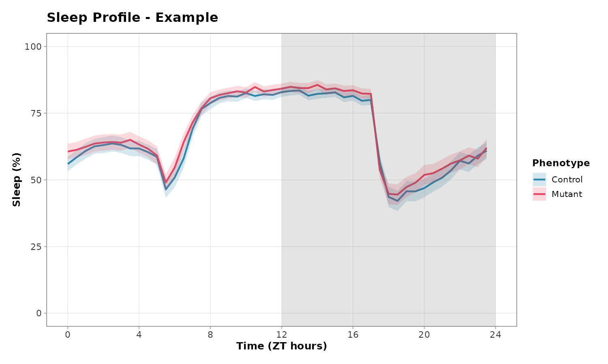
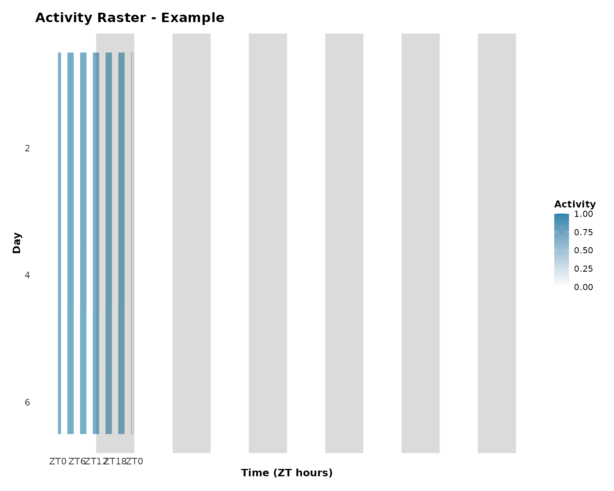
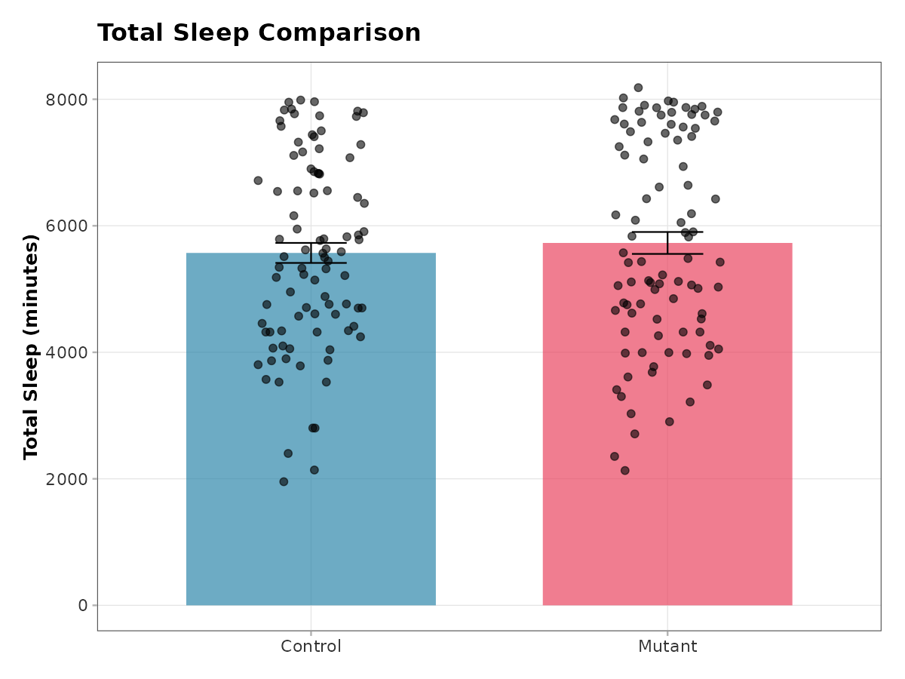

# RMB 

<!-- badges: start -->
[](https://github.com/yjli2017/RMB/actions)
[](https://opensource.org/licenses/MIT)
<!-- badges: end -->

**R**MB: **R** package for **M**ulti-**B**eam Drosophila Activity Analysis

Comprehensive tools for analyzing Drosophila (fruit fly) activity and sleep
data from TriKinetics Multi-Beam (MB) and Single-Beam (SB) monitoring systems.

## ✨ Features

- 📊 **MonitorS4 Object**: Organized data structure similar to Seurat
- 🔄 **Complete Pipeline**: Raw data → Publication-ready figures in one command
- 😴 **Sleep Analysis**: Standard 5-minute criterion for Drosophila sleep
- 📍 **Position Tracking**: Multi-beam position preference analysis
- 🎨 **Beautiful Plots**: Publication-quality visualizations with custom themes
- ✅ **Checkpoints**: Save analysis state with automatic summaries

## 📦 Installation

```r
# Install from GitHub
devtools::install_github("yjli2017/RMB")
```

## 🚀 Quick Start

### One-Command Pipeline

```r
library(RMB)

# Run complete analysis
results <- runPipeline(
  data_dir = "path/to/your/data",
  experiment_name = "My Experiment"
)

# Access processed data
monitor <- results$monitor
```

### Step-by-Step

```r
# 1. Load data
monitor_files <- list.files("data/", pattern = "Monitor.*\\.txt$", full.names = TRUE)
monitor_list <- lapply(monitor_files, function(f) {
  m <- createMonitor(f)
  processMonitor(m)
})

# 2. Merge and QC
monitor <- mergeMonitors(monitor_list)
monitor <- removeDeadFlies(monitor)

# 3. Sleep analysis
monitor@assays$awake <- activityToAwake(monitor@assays$mt)
monitor@assays$sleep <- awakeToSleep(monitor@assays$awake)

# 4. Visualize
plotSleepProfile(monitor)
plotGroupComparison(monitor, metric = "total_sleep")
```

## 📊 Example Outputs

### Sleep Profile


### Activity Raster


### Group Comparison


## 📁 Data Structure

### MonitorS4 Object

```
MonitorS4
├── @assays
│   ├── mt        # Activity (beam crosses per minute)
│   ├── pn        # Position (1-15 for multi-beam)
│   ├── awake     # Binary awake state
│   └── sleep     # Binary sleep state
├── @meta.data    # Fly metadata (phenotype, treatment, etc.)
├── @time         # Time information
└── @monitor_name # Identifier
```

## 🎨 Themes

```r
# Publication-ready theme
ggplot(data, aes(x, y)) + 
  geom_point() + 
  theme_rmb()

# Dark theme for presentations
ggplot(data, aes(x, y)) + 
  geom_point() + 
  theme_rmb_dark()

# Custom color palette
scale_fill_rmb()
scale_color_rmb()
```

## 📚 Documentation

- [Getting Started Vignette](vignettes/getting-started.Rmd)
- [Function Reference](reference/index.html)

## 🤝 Contributing

Contributions are welcome! Please feel free to submit issues and pull requests.

## 📄 License

MIT © [Yongjun Li](https://github.com/yjli2017)

## 📬 Contact

- Email: yongjunli2017@gmail.com
- GitHub: [@yjli2017](https://github.com/yjli2017)
